# The Bard's Tale — Avalonia Remake

[](https://github.com/Harlock123/AVABardsTale/actions/workflows/ci.yml)

A cross-platform .NET 9 re-implementation of the classic 1985 dungeon crawler
*The Bard's Tale*, built with [Avalonia](https://avaloniaui.net/) and a clean
MVVM architecture.

It is a **complete, winnable game**: assemble and outfit a party in the town of
Skara Brae, take on **side quests**, and descend through a **twenty-floor**
procedurally generated catacomb in a first-person grid view (auto-map, per-character
turn-based combat). Face a bestiary of **120 monsters** across ten toughness tiers,
survive status ailments, enemy spellcasters and drain attacks, plunder magic loot and
**powered wands, staves and banners**, forge your gear at the smithy, clear a **named
boss on every floor**, and finally destroy **Mangar the Mad** to free the town and roll
the credits. Town services, a fillable **bestiary**, a **quest journal**, procedural
**music & sound effects**, and a full save/load system round out the loop.

## Screenshots

| Town square | Garth's Equipment Shoppe | The catacombs |
| --- | --- | --- |
| 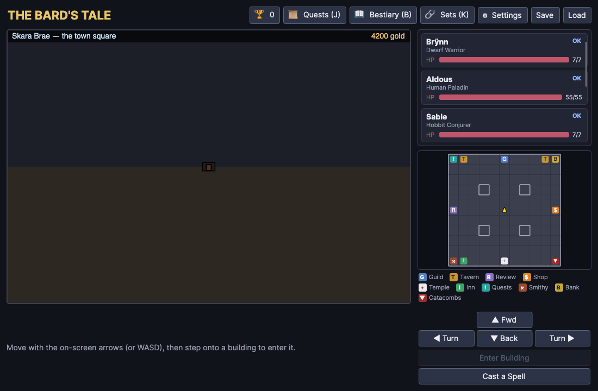 | 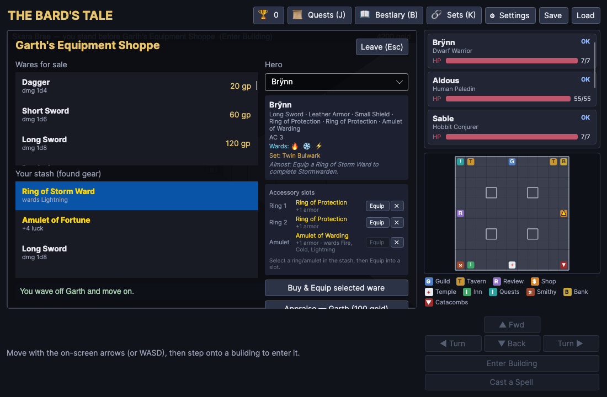 | 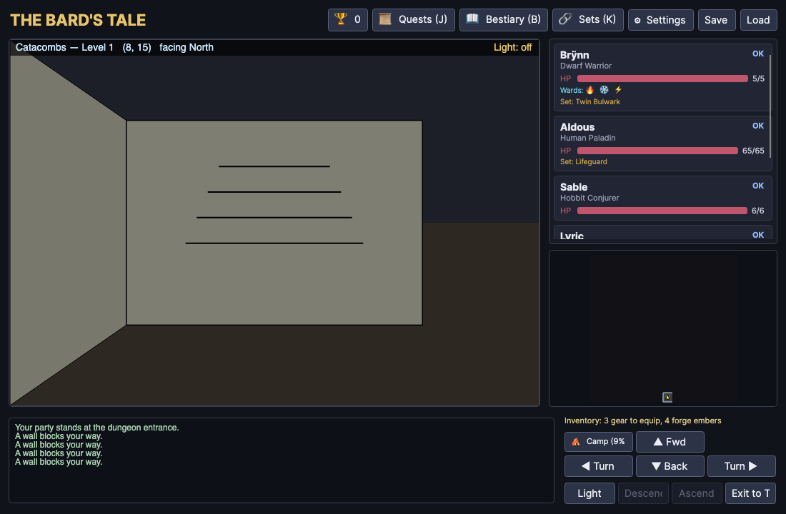 |

| Combat | The Smithy | The bestiary |
| --- | --- | --- |
| 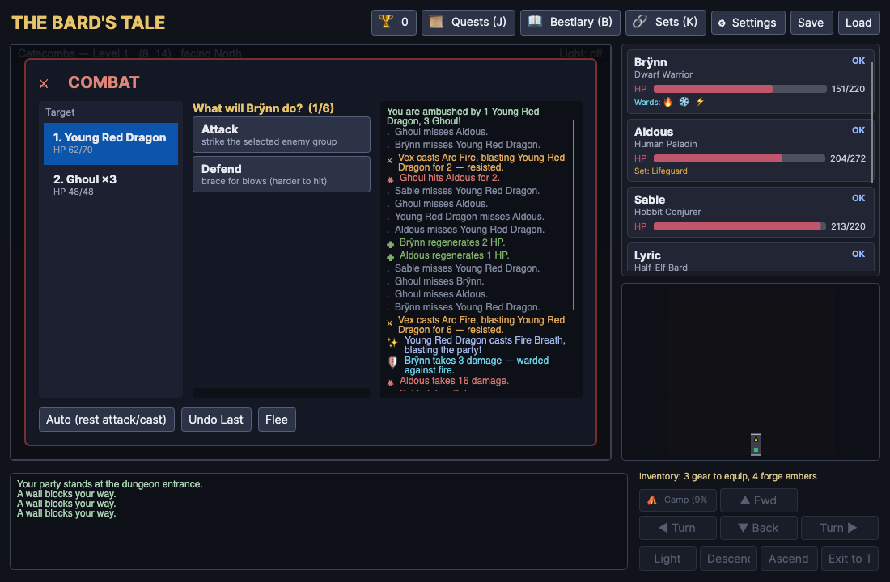 | 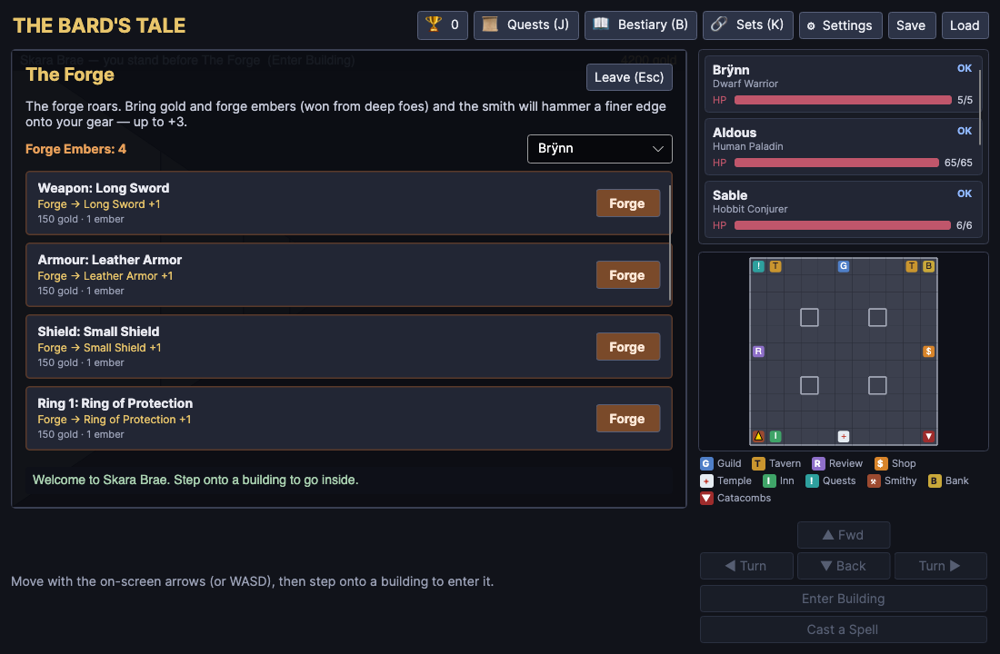 | 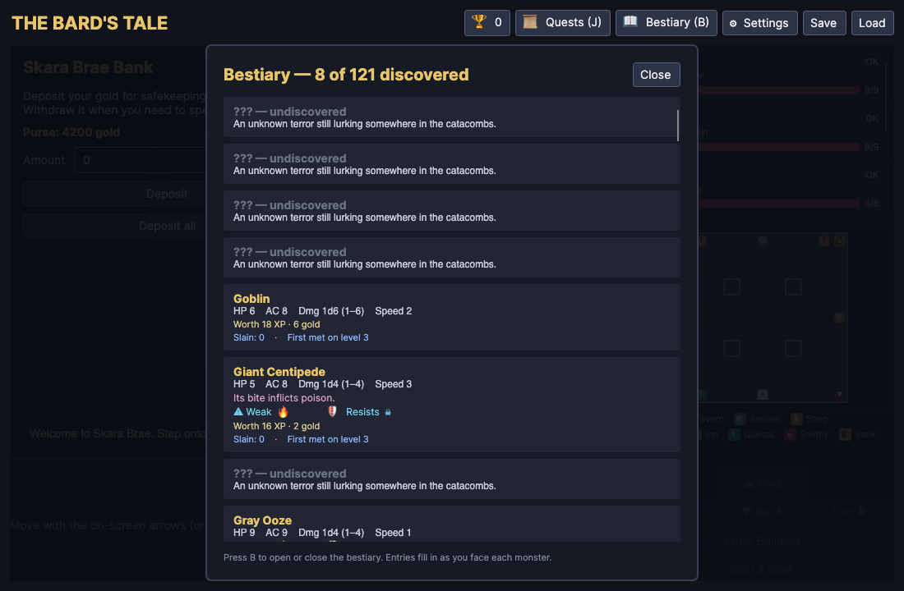 |

| Accessory-set codex | Cast a Spell |
| --- | --- |
| 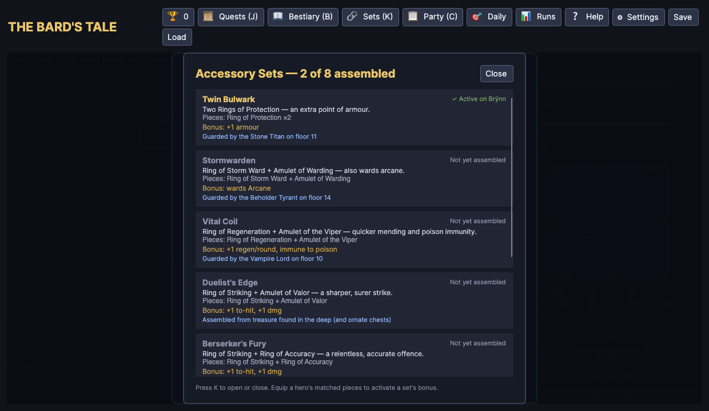 | 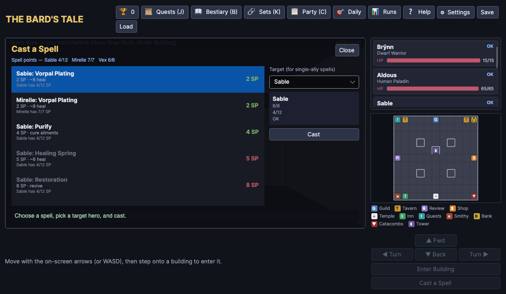 |

<details>
<summary>More of Skara Brae's buildings</summary>

| Adventurers Guild | Temple of Healing | Review Board |
| --- | --- | --- |
| 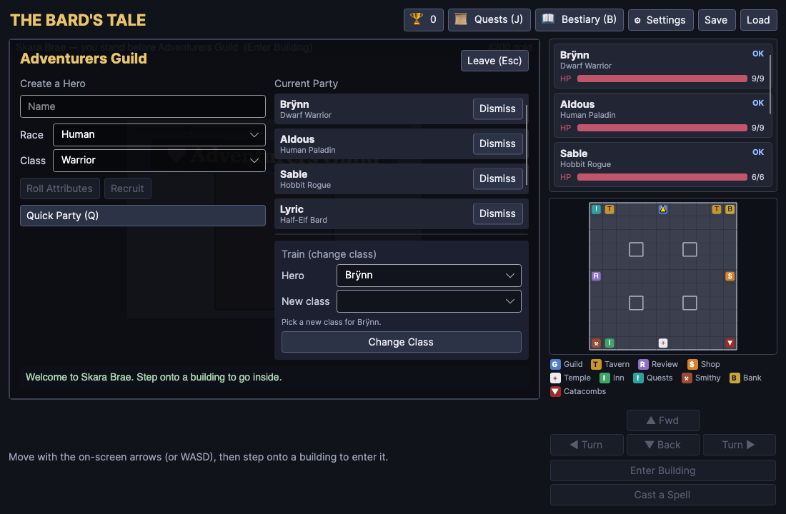 | 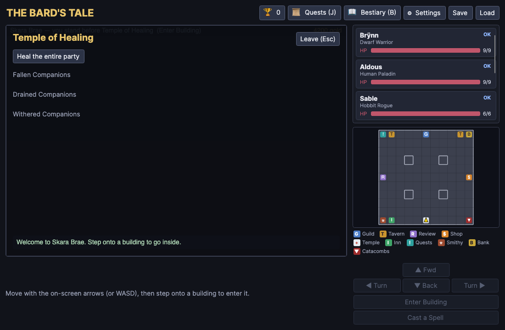 | 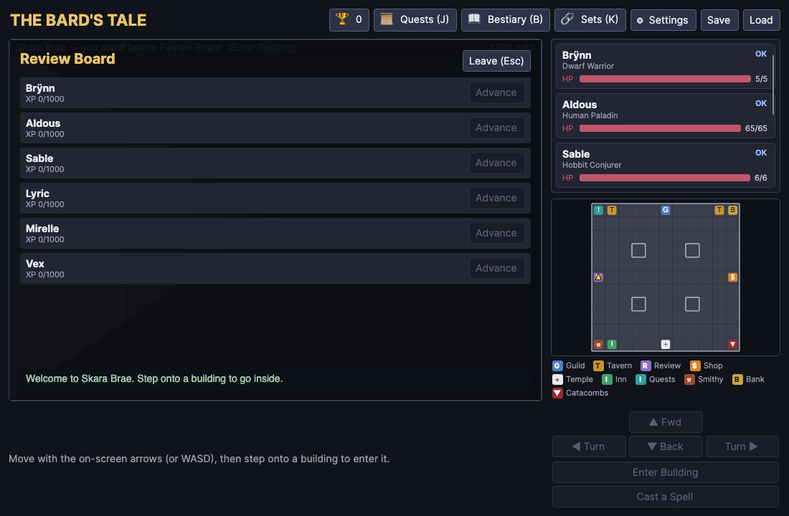 |

| Tavern | Garrick's Inn | Notice Board |
| --- | --- | --- |
| 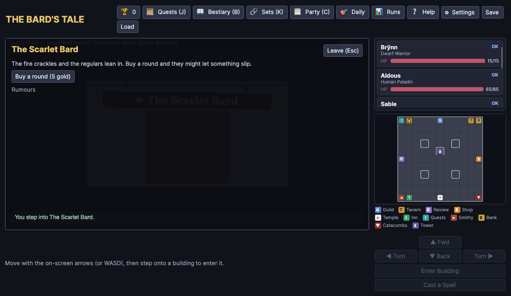 | 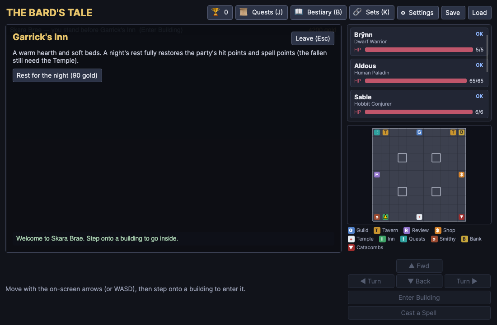 | 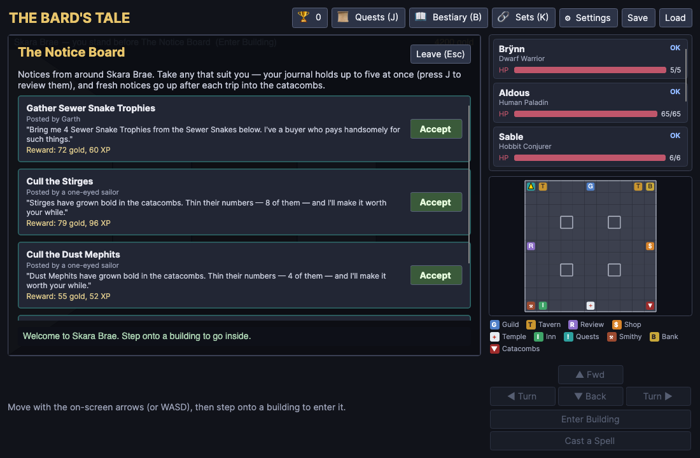 |

| The Bank |
| --- |
| 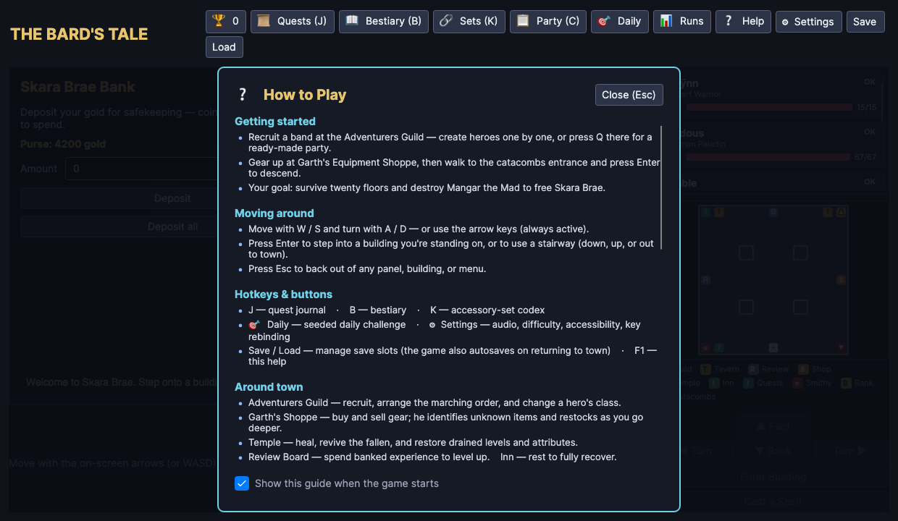 |

</details>

> These images are generated automatically. Run `scripts/screenshots.sh` (or
> `BT_SHOT=1 BT_SHOT_DIR=$PWD/SCREENSHOTS dotnet run --project src/BardsTale.Desktop`) to
> regenerate them — the desktop app drives itself through every screen and renders each to a
> PNG via Avalonia's `RenderTargetBitmap` (real fonts, theme and layout; no window-grabbing).
> A desktop session is required. (PNG is used rather than PCX, as GitHub renders PNG inline.)

## Solution layout

| Project | Purpose |
| --- | --- |
| `src/BardsTale.Core` | Pure C# game engine — no UI dependency. Characters, classes, races, items & item powers, spells, the 120-monster bestiary, maze generation, movement, the combat resolver, side quests and the smithy. Fully unit-testable. |
| `src/BardsTale.UI` | Shared Avalonia MVVM presentation layer — `App`, all views & view models, the custom `DungeonView` / `MiniMap` render controls, the save service, and a single `MainView` root. **Platform-agnostic** (no backend package), so every head below reuses it unchanged. |
| `src/BardsTale.Desktop` | Thin desktop head (Windows / macOS / Linux) — just the entry point + `Avalonia.Desktop`, wrapping `MainView` in a `Window`. |
| `src/BardsTale.Browser` | Thin WebAssembly head — runs the same UI in the browser via `Avalonia.Browser` and the single-view lifetime, as an installable PWA with IndexedDB saves. (Kept out of the default solution; see below.) |
| `src/BardsTale.Android` | Thin Android head (tablet, landscape) — a launcher `Activity` + an `AudioTrack` sound backend, wrapping `MainView` via the single-view lifetime. |
| `src/BardsTale.iOS` | Thin iOS head (iPad, landscape) — an `AvaloniaAppDelegate` entry point + an `AVAudioPlayer` sound backend. |
| `tests/BardsTale.Tests` | xUnit suite (**444 tests**) covering geometry, maze generation & connectivity, special tiles, character creation, the full combat resolver (status effects, enemy spells, drain, summoning, surprise rounds, bosses, elite/enrage AI, monster morale, front/back ranks, sustained Bard songs), item powers & forging, accessories/wards/set bonuses, treasure chests & mimics, camping, search/secret doors, riddles, levers & gates, keys & locked doors, dungeon events, town services & tavern rumours, the bestiary & lore, difficulty modes, New Game+/Ironman, run modifiers, the seeded daily challenge, story beats, run history, music & crossfade, save/load round-trips, and per-depth map persistence. |

The split follows Avalonia's standard cross-platform layout: a shared UI library plus
one thin "head" project per platform. Every head reuses `BardsTale.UI` unchanged —
the only per-platform code is the entry point and an audio backend — so the same
game runs on desktop, the browser, Android and iOS. See **Platform setup & build**
below for how to prepare a machine for each.

## Quick start

```bash
# from the repository root — desktop (Windows / macOS / Linux)
dotnet run --project src/BardsTale.Desktop

# run the tests
dotnet test
```

That's all the desktop head needs. The browser, Android and iOS heads each need a
one-time SDK workload (and, for iOS, a Mac with Xcode); see below.

**Continuous integration.** Every push and pull request to `main` runs
[`.github/workflows/ci.yml`](.github/workflows/ci.yml) on Ubuntu: it builds the desktop
head (compiling Core + UI) and runs the full test suite. The badge at the top of this
README reflects its latest status. (The mobile/browser heads aren't built in CI, as they
need extra SDK workloads and — for iOS — a Mac.)

## Platform setup & build

Every head targets **.NET 9** (`net9.0`, `net9.0-browser`, `net9.0-android`,
`net9.0-ios`) and references the shared `BardsTale.UI`. The table is the short
version; each subsection has the full machine setup.

| Head | Build OS | One-time prerequisites | Build / run command |
| --- | --- | --- | --- |
| **Desktop** | Windows, macOS, or Linux | .NET SDK 9+ (no workload) | `dotnet run --project src/BardsTale.Desktop` |
| **Browser** | Windows, macOS, or Linux | .NET SDK 9+ · `wasm-tools` workload | `dotnet run --project src/BardsTale.Browser` |
| **Android** | Windows, macOS, or Linux | .NET SDK 9+ · `android` workload · JDK 17 · Android SDK | `dotnet build -t:Run -f net9.0-android src/BardsTale.Android/BardsTale.Android.csproj` |
| **iOS** | **macOS only** | .NET SDK 9+ · `ios` workload · Xcode (license accepted) | see [iOS](#ios-ipad-landscape) |

### Common prerequisites (all heads)

1. **.NET SDK 9.0 or newer.** Install from <https://dotnet.microsoft.com/download>
   (or via `winget` / `brew` / your distro). A **.NET 10 SDK also works** — it builds
   the `net9.0-*` targets unchanged (this repo is developed on the 10.0.300 SDK). The
   only caveat: if your installed mobile/wasm *workload* is .NET-10-only, bump that
   head's `TargetFramework` from `net9.0-…` to `net10.0-…` (the relevant csprojs note
   this inline).
2. **Git**, to clone the repo.

Check what you have, and what's already installed:

```bash
dotnet --version          # 9.x or 10.x
dotnet workload list      # shows android / ios / wasm-tools-net9 if installed
```

> **Workloads need elevation.** On macOS/Linux prefix `dotnet workload install …`
> with `sudo`; on Windows run the terminal as Administrator. `dotnet workload restore`
> (run from the repo root) installs everything the projects in the solution require in
> one shot.

### Desktop (Windows / macOS / Linux)

The desktop head (`net9.0`, `Avalonia.Desktop`) needs **only the .NET SDK** — no
workload. It runs natively on all three OSes:

- **Windows** — Windows 10 or later. Nothing extra; Avalonia renders via Direct3D/ANGLE.
- **macOS** — macOS 11 (Big Sur) or later, Apple Silicon or Intel.
- **Linux** — an X11 or Wayland desktop. Avalonia needs the usual native graphics/font
  libraries, present on most desktop installs. On a minimal/headless box install them
  explicitly, e.g. on Debian/Ubuntu:
  ```bash
  sudo apt-get install -y libx11-6 libice6 libsm6 libfontconfig1 libicu-dev
  ```

```bash
# run from source
dotnet run --project src/BardsTale.Desktop

# publish self-contained, single-file builds for every desktop platform into ./dist
scripts/publish.sh                      # all six RIDs (win/osx/linux × x64/arm64)
scripts/publish.sh win-x64 osx-arm64    # …or just the ones you want

# or publish a single RID by hand
dotnet publish src/BardsTale.Desktop -c Release -r win-x64 --self-contained -p:PublishSingleFile=true
```

`scripts/publish.sh` writes a self-contained **single executable** per runtime to
`dist/<rid>/` — each bundles the .NET runtime and Avalonia's native libraries, so it runs
with no .NET install — and a matching **zip** at `dist/<rid>_BardsTale.desktop.zip`
(the executable keeps its name inside, with its execute bit preserved). .NET cross-publishes
from any host, so all six come off one machine. The `dist/` folder is git-ignored (the binaries
are ~90–110&nbsp;MB each, the zips ~40&nbsp;MB). The iOS and Android heads aren't covered here —
they build through their own SDK workloads (see below).

The build **version** is set once in [`Directory.Build.props`](Directory.Build.props)
(`<Version>`) at the repo root and applies to every project; bump it there for a release.
Any build can override it on the fly — `dotnet … -p:Version=1.2.0`, or `VERSION=1.2.0
scripts/publish.sh`.

### Browser (WebAssembly / PWA)

The `BardsTale.Browser` head (`net9.0-browser`, RID `browser-wasm`) runs the exact
same UI in a browser. It needs the one-time WASM workload and is deliberately
**excluded from `BardsTale.slnx`** so the solution still builds/tests without it.
Buildable from **any** OS (Windows/macOS/Linux):

```bash
# one-time: install the WebAssembly build tools
sudo dotnet workload install wasm-tools          # .NET 9 SDK
# on a .NET 10 SDK building the net9 target, install the matching pack instead:
sudo dotnet workload install wasm-tools-net9

# build & serve on a local dev server (prints the URL to open)
dotnet run --project src/BardsTale.Browser

# publish static files for hosting (output under bin/Release/.../AppBundle)
dotnet publish src/BardsTale.Browser -c Release
```

Serve the published `AppBundle` from any static web host. The **service worker and
"install app" PWA features require HTTPS** (browsers exempt `localhost`, so the dev
server works as-is).

> If your installed wasm workload targets .NET 10, change the browser project's
> `TargetFramework` to `net10.0-browser`.

#### Persistent saves & installable PWA

The browser head is a **Progressive Web App**:

- **IndexedDB-backed saves.** Save slots persist across reloads and sessions via
  IndexedDB (`wwwroot/saveStore.js` ↔ `IndexedDbSaveStore`). Saves are **per-browser
  and per-origin** — they don't roam between browsers or devices. On startup the app
  requests *durable* storage (`navigator.storage.persist()`) to resist eviction
  (notably Safari's 7-day purge of script-writable storage).
- **Installable & offline.** A web manifest (`manifest.webmanifest`) makes the game
  installable to the desktop/home screen, and a service worker (`service-worker.js`)
  caches the app shell and WASM runtime so it runs offline after the first load.

Persistence is selected per-platform through `App.SaveStoreFactory`: the desktop and
mobile heads use the file-backed `SaveService`, the browser head swaps in
`IndexedDbSaveStore`. Both implement the shared async `ISaveStore` interface, so the
view models are storage-agnostic.

### Android (tablet, landscape)

The `BardsTale.Android` head (`net9.0-android`, min SDK **API 23**) builds on
**Windows, macOS or Linux**. Beyond the .NET SDK it needs three things:

1. **The `android` workload:**
   ```bash
   sudo dotnet workload install android
   ```
2. **A JDK (Microsoft OpenJDK 17 recommended).** The `android` workload can install a
   bundled JDK for you; otherwise install JDK 17 and point the build at it via
   `JAVA_HOME` (or `-p:JavaSdkDirectory=…`).
3. **The Android SDK** — platform-tools, build-tools, a platform (API 34/35), and (for
   the emulator) the emulator package + a tablet system image. Two ways to get it:
   - **Android Studio** (easiest): install it, open *SDK Manager*, and it sets
     `ANDROID_HOME` for you.
   - **Command line:** install the `cmdline-tools`, then
     `sdkmanager "platform-tools" "platforms;android-34" "build-tools;34.0.0" "emulator" "system-images;android-34;google_apis;arm64-v8a"`
     and accept licences with `sdkmanager --licenses`. Point the build at it with
     `ANDROID_HOME` / `-p:AndroidSdkDirectory=…`.

Create a **tablet** emulator (the UI is laid out for a wide screen and locks to
landscape), or plug in a device with USB debugging enabled, then:

```bash
# build, deploy and launch on the running emulator / connected device
dotnet build -t:Run -f net9.0-android src/BardsTale.Android/BardsTale.Android.csproj

# produce a distributable .apk (or .aab) under bin/Release
dotnet publish src/BardsTale.Android -c Release -f net9.0-android
```

Sound is provided by a native `AudioTrack` backend (`AndroidAudioService`); saves use
the file-backed `SaveService` against the app's private storage.

### iOS (iPad, landscape)

The `BardsTale.iOS` head (`net9.0-ios`, min iOS **13.0**) **must be built on a Mac**,
because it requires Xcode's toolchain. Setup:

1. **Xcode** from the App Store, then accept its licence and select it:
   ```bash
   sudo xcodebuild -license accept
   sudo xcode-select -s /Applications/Xcode.app          # point the toolchain at full Xcode
   ```
   (If `xcode-select` still points at the Command Line Tools, prefix the dotnet
   commands below with `DEVELOPER_DIR=/Applications/Xcode.app/Contents/Developer`.)
2. **The `ios` workload:**
   ```bash
   sudo dotnet workload install ios
   ```
3. **A simulator runtime**, if you don't already have one:
   ```bash
   xcodebuild -downloadPlatform iOS
   ```

Build and run on the **iOS Simulator** (no signing required):

```bash
# create + boot an iPad simulator once
xcrun simctl create "iPad" "iPad Pro 11-inch (M4)" >/tmp/ipad_udid
xcrun simctl boot "$(cat /tmp/ipad_udid)" && open -a Simulator

# build, install and launch on it
dotnet build -t:Run -f net9.0-ios -p:RuntimeIdentifier=iossimulator-arm64 \
  src/BardsTale.iOS/BardsTale.iOS.csproj
```

Deploying to a **physical iPhone/iPad** additionally needs an **Apple Developer
account** and a signing certificate + provisioning profile (configure
`CodesignKey` / `CodesignProvision`, or open the generated Xcode project to let Xcode
manage signing). The simulator path above needs none of that.

Sound is provided by an `AVAudioPlayer` backend (`IosAudioService`); the app takes the
full screen and locks to landscape via `Info.plist`.

### Building the whole solution

`BardsTale.slnx` includes Core, UI, Desktop, **Android**, **iOS** and the tests, so a
solution-wide `dotnet build` requires the `android` **and** `ios` workloads (and, for
iOS, a Mac with Xcode). To work on just the engine and desktop app without any
workloads, build those projects directly:

```bash
dotnet test                                   # Core + UI + Desktop + tests
dotnet build src/BardsTale.Desktop
```

### Controls

- **Arrow keys / WASD** — step forward & back, turn left & right (or use the on-screen buttons).
- **Descend** — when standing on a downward stairway, drop to a deeper, more dangerous level.
- **Ascend** — from an upward stairway below the entrance, climb back to the level
  above. Each level keeps its own layout and explored map, so revisiting one finds
  it exactly as you left it.
- **Camp** — make camp anywhere in the dungeon to recover half the party's hit points
  and spell points, at the risk of a **wandering ambush** (the chance rises with depth)
  that interrupts the rest and catches the party by surprise. The **Camp button shows the
  current risk %**, and a **Rogue keeping watch** or a **Bard's soothing song** each lower it.
- **Exit to Town** — from the entrance stairway, return to Skara Brae.
- **Enter / Return** — enter the building you're standing before, or use the stairway
  you're on. **Esc** backs out of a building, panel or quest offer. **Q** assembles a
  Quick Party in the Adventurers Guild.
- **Quest journal (J)**, **Bestiary (B)** and the **accessory-set codex (K)** — open from
  anywhere (also top-bar buttons). **Settings (⚙)** holds reduced-motion, interface size,
  autosave, audio, difficulty, Ironman, run modifiers and the accessibility options.
- **Run history (📊 Runs)** — a dashboard of your completed runs (wins and Ironman deaths):
  each shows the outcome, deepest floor and score, with tags (Ironman / New Game+ / difficulty /
  daily-challenge seed) and date — above **lifetime totals** (runs, victories, deepest floor,
  best score, monsters slain). Stored outside the save slots, so it survives an Ironman wipe.
- **Help (❔ / F1)** — an in-game **how-to-play overlay** that onboards the controls and
  systems: getting started, movement (showing your current — rebindable — keys), the town
  buildings, dungeon exploration, combat, and survival tips. It **opens automatically on a
  first-ever launch** (a *"show this guide when the game starts"* checkbox lets you turn that
  off — it's also a Settings toggle). Open it any time from the top bar or with **F1**; **Esc** closes it.
- **Light** — conjure light (a Bard's *Watchwood Melody* for free, or a mage's
  *Mage Flame* for spell points) to see and map darkness for a number of steps.
- **Save / Load** (top bar) — opens a slot picker with **three named save slots**
  plus an **Autosave**. Each slot shows a summary (party size, gold, location). The
  whole game — party, gold, inventory, town position, and the explored dungeon — is
  persisted to disk. The game **autosaves** every time you return to town from the
  dungeon.

### Combat

Combat is round-based and resolved per character. Each round you give an order to
every able party member in turn:

- **Attack** the selected enemy group. Only the **front rank** (the first three in
  the marching order) can reach with melee; a back-rank hero needs a **ranged weapon**
  (a sling, bow or crossbow) to **Shoot** past the front line — otherwise their best
  move is a spell, a song, or Defend.
- **Cast** a specific spell from that caster's known list — damage, healing,
  revival, or party buffs. Spell points are spent. Single-ally spells (heal, cure,
  revive) open a **target picker** so you choose exactly which companion to affect;
  damage spells hit the selected enemy group; party buffs/AOE need no target.
- **Sing** a Bard song for a party-wide effect (no spell points) — see *Bard songs* below.
- **Use** a consumable from the party stash — healing potions, mana draughts,
  antidotes and resurrection dust, each targeted at a chosen ally.
- **⚡ Use** a wielded item's **once-per-fight power** (if you carry a wand, staff,
  rod or banner — see *Item powers & the Forge*).
- **Defend** to become harder to hit.

Pick a **Target** group on the left for offensive actions. **Auto** fills the
remaining orders with sensible defaults and resolves the round; **Undo Last**
steps back; **Flee** attempts to escape. Initiative interleaves party and monster
actions; protection-spell buffs last the whole encounter (songs are sustained — see below).

**Front & back rank tactics.** Monsters' melee strikes only reach the **front rank**
(your first three living heroes), so the back rank is shielded from blades — but not
from area spells and breath. Arrange your line in the **Adventurers Guild** roster
with the **▲/▼** buttons (each hero is tagged *Front*/*Back*): put your armoured
fighters up front and your fragile casters behind, and arm the back rank with a bow
or crossbow so they can still fight.

**Bard songs are sustained.** A song's effect lasts only the round it is **sung** —
a Bard must keep playing to maintain it, and the buff lapses the moment they do
anything else (the log notes the strains fading). Striking up a *new* tune spends one
of the Bard's limited **daily tunes** (shown as *♪ Tunes n/max*; sustaining the same
song round-to-round is free); they refill by **resting** at the Inn or **camping**.
Songs include warding/emboldening war-chants, a healing ballad, and the *Hymn of
Renewal*, which mends a little of the whole party every round it is held.

**Monster morale.** When the tide turns against them, ordinary monsters can **lose
their nerve and rout** — a badly-wounded, outnumbered creature may flee the field
entirely (granting no XP or gold). Bosses, elite champions (which **enrage** instead)
and the toughest brutes never break.

A fight may open with a **surprise round** rolled from the party's luck: an
**ambush** lets the monsters strike before you can react, while catching foes
**unawares** gives the party a free opening round. Luckier parties surprise more
and are ambushed less.

Some monsters inflict status ailments on a hit:

- **Poison** (Giant Spider) bites for damage at the start of each combat round and
  with every step taken in the dungeon.
- **Sleep** (Will-o-Wisp) makes a member skip their turns; they may wake on their
  own, are jolted awake when struck, and always rouse when the fight ends.
- **Paralysis** (Ghoul) locks a member out of acting until they shake it off or are
  cured.

Others have nastier special attacks on a hit:

- **Level drain** (Wraith) saps a level, lowering the victim's max HP/SP. A drained
  hero can't advance at the Review Board until the **Temple restores their lost
  levels** for a fee.
- **Stat drain** (Crypt Crawler) withers a random attribute; the **Temple restores
  withered attributes** for a fee too.
- **Gold theft** (Cutpurse) snatches coin straight from the party purse.

Cure ailments with the Conjurer's **Purify** spell, by **Resting**, or at the
**Temple** in town. Afflicted members show a coloured tag (POISON / SLEEP / PARA)
in the roster.

Some monsters cast spells of their own instead of attacking:

- The **Coven Witch** casts *Slumber*, putting party members to sleep (a luckier
  hero is likelier to resist).
- The **Mad God Acolyte** casts *Mending Chant*, healing its most-wounded ally —
  watch an enemy group's HP climb back up in the target list.
- The **Necromancer** casts *Summon Dead*, calling fresh **Skeleton reinforcements**
  into the fight (a new group appears in the target list, up to a cap).
- The **Spark Imp** and **Flame Shade** blast the whole party with area damage
  (*Spark* / *Cinderblast*); a luckier hero takes only half.
- The **Hex Adept** hurls a focused *Soul Bolt* at a single hero for heavy damage.

### Item powers & the Forge

Beyond plain "+N" gear, the deeper floors and bosses drop **powered items** — wands,
staves, rods and banners you wield in place of a weapon. Each carries a single
**once-per-fight power** that fires for **free** (no spell points) from the **⚡ Use**
action in combat. They drop unidentified, so appraise them at Garth's like any magic
loot. The full set:

| Item | Power | Effect |
| --- | --- | --- |
| Wand of Flames | Flame Burst | ~18 fire damage to one foe |
| Wand of Frost | Frost Lance | ~24 cold damage to one foe |
| Staff of Ruin | Ruinous Bolt | ~32 damage to one foe |
| Staff of Storms | Thunderstrike | damage to **all** foes |
| Wand of Leeching | Soul Drain | damages a foe and **heals the wielder** |
| Rod of Mending | Renewal | heals the whole party |
| Scepter of Grace | Mending Touch | heals one ally |
| Rod of Resurrection | Raise Ally | **revives a fallen companion** |
| Banner of Haste | Haste | party gains **+1 attack each round**, all fight |
| Standard of Renewal | Aura of Renewal | party **regenerates HP every round**, all fight |
| Aegis Banner | Aegis | party armour **+3** for the fight |
| Horn of Valor | Warcry | party attacks **+3** for the fight |
| Chime of Cleansing | Cleansing Peal | cures the whole party of ailments |
| Orb of Mana | Mana Font | restores **spell points** to the party |

Every one of these effects is **also a learnable spell**, spread across the schools —
the heal / cleanse / regen / revive ones live with the **Conjurer**, and the
drain / haste / mana ones with the **Magician / Sorcerer** war-mages — so a caster
can wield the effect from memory at the Review Board even without the item.

> **The Forge is a separate thing.** It never bestows powers — it upgrades
> **enchantment bonuses**. Spend **gold + forge embers** (a material dropped by
> deep-floor fights and bosses) and the town smith raises a weapon/armour/shield's
> "+N" one step at a time, up to **+3**, on equipped or stashed gear.

### The Skara Brae overworld

The game opens in the frozen town square of **Skara Brae**, which you explore in
the same first-person view as the dungeon (arrow keys / WASD; an auto-map tracks
where you've been, with gold markers for buildings). Walk up to a building and
press **Enter** (or the on-screen *Enter Building* button) to go inside:

- **Adventurers Guild** — create heroes (name, race, class, re-rollable
  attributes) and recruit them into a party of up to six, or hit **Quick Party**
  for a ready-made band. Dismiss heroes here too.
- **Garth's Equipment Shoppe** — buy and equip weapons, armour, shields and
  **accessories** (rings & amulets — including basic elemental wards)
  (swapping gear sells the old piece back for half its value; class restrictions
  apply), stock up on potions, **sell** loot you don't need for half its value,
  **appraise unidentified magic loot**, and **equip the gear you've looted** from
  your stash onto any hero (the piece they were wearing returns to the stash).
- **The Forge** — the town smithy. It doesn't grant powers; it **sharpens
  enchantments**. Bring **gold and forge embers** (a crafting material that drops
  from deep-floor fights and bosses) and the smith raises a weapon, armour,
  shield **or accessory's** "+N" one step at a time, up to **+3** — a warding ring
  keeps its element as it gains armour — working on equipped gear or anything in
  your stash. See *Item powers & the Forge*.
- **Temple of Healing** — heal the whole party, resurrect the fallen, or restore
  levels and attributes sapped by drain attacks, all for gold.
- **Review Board** — spend banked experience to level heroes up.
- **The Scarlet Bard** & **Mad Mable's** — taverns where you buy a round of drinks
  to loosen tongues and hear rumours. Many are **dynamic, progress-aware tips**: the
  named **boss waiting on the next floor down**, a real creature that **prowls that depth**,
  and nudges toward the **secrets, riddles and locked vaults** still unclaimed in the
  catacombs you've explored — useful reconnaissance, mixed in with the house's usual gossip.
- **Garrick's Inn** — rent a room for the night to fully restore the party's hit
  points **and spell points** for a flat per-head fee (the fallen still need the
  Temple).
- **The Notice Board** — browse and accept **side quests** posted by Garth, the
  tavern regulars, and folk you meet in the streets. A fresh batch goes up after
  each trip below. See *Side quests*.
- **The Catacomb Stair** — step onto it to descend into the dungeon (and return to
  town from the dungeon's entrance stairway any time).

The town also has a **Cast a Spell** menu (no building needed): pick a caster's
restorative spell — heal an ally, heal the party, cure ailments, or revive the
fallen — and a target, and cast it for spell points instead of paying the Temple.
The menu shows each caster's **spell points**, every spell's **cost**, and dims the
ones a caster can't yet afford (affordable spells sort to the top). The **in-combat
spell picker** mirrors this: the acting caster's SP (with a "too low to cast" nudge),
each spell's cost, affordable spells first, and unaffordable ones dimmed rather than
hidden — and picking one you can't pay for is refused without wasting the turn.

### The twenty floors

The catacomb runs **twenty floors** deep. Each carries its own procedurally generated
maze (persisted per depth), a **distinct named boss lair** guarding it, and a
wandering-monster pool drawn from progressively tougher tiers — rats and kobolds up
top, dragons, liches and titans at the bottom. **Experience scales with depth** (it
grows geometrically as you descend), so the party's level keeps pace with the climb
down to **Mangar the Mad** on floor 20.

### Side quests

Townsfolk hand out **side quests** three ways: **Garth** offers them at the Shoppe,
**tavern regulars** when you buy a round, and **strangers** stop you in the streets —
or you can browse the **Notice Board** for a rotating batch. There are three kinds:

- **Hunt** — slay a number of a given monster ("cull six Kobolds").
- **Collect** — gather trophies dropped by a monster ("three Spider Venom Glands").
- **Retrieve** — recover a relic carried by a tougher foe of the deep.

Progress ticks automatically as you fight. Open the **quest journal** (the *📜 Quests*
button or **J**) to review active quests, their progress, the reward, and where to
hand each in — or **abandon** one (with a confirm). Turn a finished quest in by
returning to its giver (Garth's, or a tavern) to collect **gold, experience and
sometimes an item**. The whole journal is saved with the game.

### The bestiary

A **bestiary** (the *📖 Bestiary* button or **B**) catalogues all **120 monsters** —
the wandering foes of all ten tiers plus the twenty floor bosses — and the lurking
**mimic** besides, for 121 in all. An entry fills in
the moment you first face a creature (even if you flee), and its kill tally grows
with every victory. Each discovered card opens with a line of **lore** — bespoke for the
bosses and marquee foes, and drawn from the creature's nature for the rank-and-file — then
shows its HP, armour class, damage, speed, special abilities (poison, drains, breath
weapons, spells…), a **drop hint** at the spoils it yields (and the bosses' guaranteed magic
item), its XP/gold worth, elemental weaknesses/resistances, and the floor you first met it.
Undiscovered monsters show as `??? — undiscovered`, so filling the book is a long-game goal.
Your progress persists in the save.

### Accessories, elemental wards & treasure chests

Beyond weapons, armour and shields, each hero wears up to **three accessories** — **two
rings and an amulet** — each managed in its **own slot** at Garth's (equip a chosen ring
to Ring 1 or Ring 2, or unequip any slot back to the stash). Most accessories are
**elemental wards**: a Ring of Fire Ward, Frost Ward, Storm Ward or Amulet of the Viper
**halves** the damage its element deals to the wearer, while the rarer **Amulet of
Warding** (fire, cold and lightning) and **Talisman of the Ages** (every element) guard
against several at once. Others grant **combat boons** — a Ring of Striking (+damage),
Ring of Accuracy (+to-hit), Ring of Regeneration (heals each combat round), Ring of Free
Action (immunity to paralysis and sleep), Amulet of Fortune (+luck on saves) or Amulet of
Valor — or **bolster vitality**: a Ring of Vigor and Amulet of Vitality raise **maximum hit
points**, and an Amulet of the Magi raises **maximum spell points** (the extra is granted the
moment you equip it, and healing/resting fills the new headroom). A plain **Ring of
Protection** simply sharpens armour class, and **bonuses from all three slots stack**. Each hero's active wards are shown as cyan element glyphs on the
roster (*"Wards: 🔥 ❄ ⚡"*) and on their character panel at Garth's.

**Set bonuses** reward matched pairs (the pieces still count once enchanted): two Rings of
Protection (**Twin Bulwark**) grant an extra point of armour; a Ring of Storm Ward + Amulet
of Warding (**Stormwarden**) adds an arcane ward; a Ring of Regeneration + Amulet of the
Viper (**Vital Coil**) speeds mending and grants poison immunity; a Ring of Striking + Amulet
of Valor (**Duelist's Edge**) or two offensive rings (**Berserker's Fury**) sharpen every
blow; a Ring of Free Action + Amulet of the Viper (**Warden's Resolve**) leaves a hero
immune to every affliction; and a Ring of Vigor + Amulet of Vitality (**Lifeguard**) deepens
the hit-point pool and mends each round. The all-in **three-piece** **Elementalist's Regalia** (Ring of
Fire Ward + Ring of Frost Ward + Amulet of the Viper) completes protection against *all five*
elements. Active sets show in gold on the character panel and combat roster, and when a hero
is **one piece away** the panel nudges you (*"Almost: Equip a Ring of Storm Ward to complete
Stormwarden."*). **Ornate chests** sometimes yield a whole **matched set** as a themed haul,
and a handful of **lair bosses guard a specific set as a guaranteed reward** (the Dragon
Tyrant on floor 19 drops the full three-piece Elementalist's Regalia). Recovering a complete
set is **called out by name** in the log (*"✦ You've recovered the Twin Bulwark set…"*). An
**accessory-set codex** (the *🔗 Sets* button or **K**) lists every set — its pieces, bonus,
where to find it (which boss guards it, on which floor), and whether the party has it assembled.

Accessory effects are surfaced in the **combat log** as they fire: regeneration ticks
(*"Brynn regenerates 2 HP."*), elemental wards and luck softening a blast (*"… — luck softens
it, warded against fire."*), and free-action shrugging off paralysis or sleep.

Wards matter because monsters hurl **elemental** attacks — dragon breath, a flame
shade's cinderblast, a storm giant's thunderclap, an acid breath — and warded gear
halves the matching blow. (Foes have their own affinities too: strike a monster's
**weakness** for double damage, its **resistance** for half — both shown in the bestiary.)

Garth's starts with only the **entry-tier defensive accessories** (the single-element wards
and a Ring of Protection), but **restocks as you progress** — reaching floors 4, 8, 12 and 16
unlocks progressively stronger effect and vitality accessories for sale (the panel tells you
which floor the next batch unlocks at, and a **town-return notice** announces when a dive has
expanded his stock). The very best gear still drops first from elites,
chests and bosses, and the legendary **Talisman of the Ages** stays treasure-only. Any
accessory can be **sold and appraised** at Garth's, and the **Forge** can enchant a warding
ring **+1/+2/+3** — each tier adding a point of armour while keeping its ward.

**Treasure chests** dot every floor. Step onto one and choose to **open** or **leave** it.
Most are trapped: your ablest **Rogue** tries to disarm the snare first, and a failure
springs an **elemental trap** on a random hero (which — naturally — warding gear softens).
Then the chest yields its spoils: gold and prizes weighted toward accessories and
enchanted gear. Two twists keep them tense:

- **Ornate chests** — gilded and obviously valuable, **always trapped** and harder to
  crack, but they guarantee a **warding accessory** and a fatter haul.
- **Mimics** — a plain chest is occasionally a predator in disguise. Open it and it
  sprouts teeth, dropping you straight into a fight with a depth-scaled **Mimic**
  (itself a catalogued bestiary entry).

### Settings, music & sound

A **Settings** screen (the ⚙ button) exposes, all persisted across sessions:

- **Reduced motion** (stops idle animations such as the swaying storefront signs),
  **autosave** on return to town, and **interface size** (0.8–**1.6×** scale, to enlarge
  all text and controls).
- **Independent volume sliders** for **sound effects** and **background music**, a
  master **mute**, a **music on/off** toggle, and a **crossfade** toggle.
- **Accessibility**: a **colourblind-friendly combat-log palette** (an Okabe–Ito scheme
  with no red/green pairings — and every line is icon-tagged regardless of colour), and
  **rebindable movement keys** (pick Forward/Back/Turn keys from a dropdown; the arrow keys
  always work as a fixed fallback).

All audio is **synthesised procedurally** — no asset files. Short **sound effects**
(footsteps, combat, spells, town services) and looping **music tracks** that switch with the
game state are generated in code: a warm town theme, a driving combat theme, a victory
fanfare, and **three catacomb themes that darken as you descend** — an ominous upper-crypt
ambience (floors 1–6), a brooding lower-crypt theme (7–13), and a slow, dissonant dread for
the abyss (14+). Each plays through a per-platform backend on every head (macOS `afplay`,
browser Web Audio, Android `AudioTrack`, iOS `AVAudioPlayer`), crossfading at the boundaries.

When the scene changes, tracks **crossfade** into one another (a smooth dip through
silence — fade the old track out, swap, fade the new one in) on backends that can ramp
volume live (iOS, Android, browser); the macOS `afplay` backend, which can't change a
running clip's volume, falls back to a clean cut. Crossfade can be turned off in Settings.

## What's implemented

- Six classic classes wired up (Warrior, Paladin, Rogue, Bard, Hunter, Monk and
  the four spellcasting schools), seven races, and the five core attributes
  (ST / IQ / DX / CN / LK).
- 4d6-drop-lowest attribute rolls, race modifiers, derived HP/SP, starting gear.
- A full town loop: recruitment, shopping, healing/revival and levelling, with a
  persistent party and shared gold purse that survive trips into the dungeon.
- Recursive-backtracker maze generation with extra loops, stairs, message tiles,
  and special tiles — **spinners** (randomise your facing), **teleporters** (whisk
  you across the level), **darkness** zones (the view blacks out and can't be
  mapped — until you conjure **light**), **traps** (spring for damage), and
  **anti-magic** zones (spells and songs fizzle for both sides). All survive save/load.
- **Search & secret doors** — every floor hides **secret vaults**, sealed dead-ends reachable
  only by **Searching** (the *🔍 Search* action) the walls; a Rogue finds them far more reliably,
  and **passively notices** hidden doors just by walking past them. A HUD readout hints at how
  many secrets a floor still holds, and riddle tiles are marked on the auto-map. Each opened door
  reveals a treasure-stocked hidden room.
- **Riddle tiles** — an inscribed tile per floor poses a classic riddle; **type the answer** to
  open a hidden cache of gold and loot (answers ignore case, articles and spacing; wrong guesses
  let you try again). The answer field auto-focuses (raising the soft keyboard on mobile) and
  submits on **Return**, with the prompt anchored clear of the on-screen keyboard.
- **Levers & barred gates** — a treasure vault is sealed behind an **iron portcullis** you
  can see but not pass (*"some lever must raise it"*). A **rune lever** waits elsewhere on the
  floor; find it, **pull it**, and every barred gate on the level grinds open. The gates show as
  amber dashed segments on the auto-map, the lever is marked, and the HUD readout counts how many
  gates still bar the way — a find-the-mechanism puzzle distinct from searching and riddles.
- **Keys & locked doors** — another vault is sealed behind a **locked door** (a steel-blue dashed
  segment on the auto-map). Its **iron key** lies elsewhere on the floor; step onto it to pocket it
  (the party's carried-key count shows in the HUD), then bump the door to spend a key and unlock it.
  A separate carry-the-key puzzle alongside the lever's find-the-switch one.
- **Dungeon events** — non-combat scenes between the fights: a **wishing well**, a **trapped
  merchant**, a **gambling imp**, a **crumbling shrine**, an **abandoned camp**. Each presents a
  short scene and **two or three choices** with outcomes — boons, gambles (double-or-nothing),
  blessings or curses, healing, treasure, or a thief in the dark. One-shot, marked on the auto-map.
- **Camping** — rest anywhere in the dungeon to recover half the party's HP and spell
  points, gambling against a depth-scaled chance of a surprise wandering ambush.
- A **fixed boss lair** on each level (guarding the descent) — a tough named boss
  flanked by minions, cleared permanently once beaten; the boss changes by depth.
  Every boss is **guaranteed to drop a magic item**.
- A **light main-quest thread**: scripted **story beats** play the first time the party reaches
  certain floors (the descent, a torn journal page, a ghost's warning, the Mad God's mark, the
  deepening cold, the tower's shadow, and the confrontation), giving the dive a narrative arc
  toward Mangar. Each plays once and is tracked in the save.
- A **final boss and win condition**: descend to the deepest level to face
  **Mangar the Mad**. He drops his **signature legendary, Mangar's Staff**; destroy
  him and his guard to free Skara Brae and win the game. A **victory / credits
  screen** then shows your heroes and a tally of the run (battles won, monsters
  slain, gold plundered, deepest level reached), with the option to start anew.
- **New Game+**: from the victory screen, **carry your party forward** — levels, gear,
  gold and stash intact and fully rested — into a tougher run. Each **ascension** (shown
  as an `NG+n` badge) scales every monster and boss up: more HP, harder hits, and richer
  XP and gold rewards. Ascension persists across saves.
- **Ironman (permadeath)**: an opt-in mode (Settings) for a new run. A **total party kill
  ends the game for good** — the save is wiped and there's no revival — and **manual save
  and load are disabled** so death can't be undone. The run shows a `☠ IRONMAN` badge and
  relies on the autosave alone. Ironman composes with New Game+.
- **Difficulty modes**: choose **Relaxed**, **Normal** or **Hard** for a run (Settings, before
  you descend). Each scales monster HP and damage, wandering-encounter frequency, camp-ambush
  risk and XP/gold rewards — Relaxed is a gentler descent, Hard is tougher and more frequent but
  pays out richer. A non-Normal run shows a difficulty badge, and the choice stacks with both
  New Game+ ascension scaling and Ironman. Persisted with the save.
- **Run modifiers (mutators)**: opt-in challenges chosen in Settings for a new run, **stacking
  with difficulty and New Game+** — **No Shops** (Garth's boarded up), **Relentless** (far more
  ambushes), **No Camp** (no resting in the dungeon), **Pauper** (half gold & XP), and **Cursed
  Loot** (all treasure found unidentified). Each makes the run harder and **raises your score**
  (+20% apiece); a `⚗ N mutators` badge marks the run. Persisted with the save.
- **Seeded daily challenge** (`🎯 Daily`): a run on a shared **seed** — the same dungeon, monsters
  and loot for everyone — played with the **ready-made party**, on **Normal**, to the **death**
  (Ironman). The panel offers **today's date-derived seed** or any seed you type (share one to
  challenge a friend) and shows your **best score** for it. Runs are **scored** (depth dominates,
  with bonuses for battles, kills, gold, and a big payout for winning); the victory/defeat screen
  shows your score and flags a **new best**, recorded per seed (and kept even when the Ironman
  save is wiped).
- First-person pseudo-3D rendering with a receding vanishing point and depth shading.
- Auto-map that reveals only visited cells, with a directional party marker.
- Per-character turn-based combat: initiative, multiple attacks per round,
  monster groups, fleeing, and XP/gold rewards. The **combat log is colour-coded and
  iconed** by event — blows you land vs. blows taken, heals/regen (green), wards & saves
  (cyan), kills, deaths, misses, status and casts — so a busy round reads at a glance, and
  **floating damage/heal numbers** pop over each struck enemy group and wounded hero,
  with **combat juice** to match — a struck foe **flashes** on impact and the screen gives a
  brief **shake** when the party takes a blow (both suppressed by the Reduced-motion setting).
- A **twenty-floor dungeon** with a **bestiary of 120 monsters** across ten toughness
  tiers, depth-banded so each floor draws from a tougher pool than the last, plus a
  **distinct named boss lair on every floor** (twenty in all) down to Mangar. **XP
  scales geometrically with depth**, keeping the party's level in step with the climb.
- **Elite monsters** — a wandering pack is occasionally led by a lone **elite** (the chance
  rises with depth): a buffed champion (~1.8× HP, harder-hitting, faster) worth far more XP
  and gold and dropping a **guaranteed extra prize**. Elites keep their base creature's
  abilities and elemental affinities, fold into that creature's bestiary entry, and stand
  out in gold on the combat screen.
- Per-school spell lists (Conjurer / Magician / Sorcerer / Wizard) that grow with
  caster level — from level-1 cantrips up to **level-5 capstones** like *Resurrection
  Field* (revive the whole party at once), *Meteor Swarm*, *Temporal Surge* and
  *Annihilation* — plus Bard songs and encounter-long party buffs from protective
  spells and songs.
- **Martial signature abilities** — every non-casting class has a **once-per-fight** manoeuvre
  that makes it as distinct as the mages: the **Warrior's Cleave** (strike *every* foe in a
  group), the **Paladin's Smite** (a radiant double-damage strike), the **Rogue's Backstab**
  (triple damage, usable from any rank), the **Hunter's Called Shot** (a ranged double-strike
  that may fell a lesser foe outright), and the **Monk's Stunning Strike** (a blow that can stun
  the target). Physical, so they work even where magic is dead.
- **Monster-side status effects** — your magic can debilitate foes, not just hurt them:
  *Mind Fog* (Sorcerer) **lulls an enemy group to sleep** so they skip their turns until
  they wake or are **struck awake**, and *Venom Spray* (Magician) **poisons a group** so it
  bleeds HP every round. Tougher creatures — and bosses & elites especially — **resist
  control**, so crowd-control rewards picking on the rabble. Afflicted groups show a 💤/☠
  glyph on the combat target list. (The classic symmetry: the foes' own casters do this to you.)
- **Bard songs** — sustained party effects a Bard keeps playing round to round, from
  warding/emboldening war-chants and a healing ballad to the *Hymn of Renewal*
  (per-round regen), the *Cantata of Mana* (per-round party SP), and the *Dirge of the
  Doomed* (a battle dirge that withers every foe each round). Striking up a new tune
  spends one of the Bard's limited daily tunes; resting refills them.
- Level-gated spell/song learning at the Review Board.
- Item drops from defeated foes into a shared party stash, consumable potions
  usable on a chosen ally mid-combat, potions for sale at Garth's, and equipping
  looted weapons/armour/shields from the stash (with the old piece stowed back).
- **Magic item drops** — enchanted "+1/+2/+3" weapons and armour (rarer the
  higher the bonus) that improve damage, to-hit and armour class, shown in gold.
  Magic loot drops **unidentified** (a vague "Unidentified Weapon" in purple). At
  Garth's you can reveal it three ways before equipping it: **pay Garth** a flat
  fee, have a **Rogue** appraise it for free (skill-based, can fail and be retried),
  or cast a Magician's **Scrye Sight** spell for a reliable read.
- **Powered items** — fourteen wands, staves, rods and banners that drop on the
  deeper floors, each with a **once-per-fight power** (damage, drain-and-self-heal,
  party heal/regen/haste/cleanse/mana, armour & attack buffs, or raising the fallen).
  Every power is mirrored by a **learnable spell** across the casting schools. See
  *Item powers & the Forge*.
- **Signature legendaries** — four named lair bosses each guard a **boss-exclusive
  legendary weapon** (the Demon Lord's *Hellbrand*, the Lich King's *Staff of the
  Archmagi*, the Death Tyrant's *Soulreaver*, and the Dragon Tyrant's *Wyrmslayer*) —
  a mighty weapon in its own right that also carries a **devastating once-per-fight
  power**. Mangar's Staff is the twentieth, granted on his defeat.
- **The Forge (smithy)** — upgrade a weapon, armour, shield or **accessory's**
  enchantment "+N" up to **+3** for **gold + forge embers**, a crafting material
  that drops from deep-floor fights and bosses (a warding ring keeps its element
  as it gains armour). Works on equipped gear or stash.
- **Accessories, effects & set bonuses** — each hero wears **three accessories
  (two rings + an amulet)**, managed in **individual slots** at Garth's (equip to a
  chosen slot, unequip back to the stash). Most are **elemental wards** that halve a
  matching attack's damage (fire, cold, lightning, poison, or several at once); others
  grant **combat effects** — extra damage/to-hit, per-round regeneration, paralysis/sleep
  immunity (free action), luck on saves, or a **bigger max HP / spell-point pool**. Bonuses from all three slots **stack**, and
  matched pairs trigger **set bonuses** (e.g. twin protection rings, or a ring + amulet of
  the same theme). Monsters wield elemental breath and blasts, so wards matter; monsters
  also have their own **weaknesses (×2) and resistances (÷2)**. Bought/sold/appraised at
  Garth's, dropped in the deep, and enchantable at the Forge. Active wards, set bonuses
  and bestiary affinities show as cyan/gold **glyphs and badges**.
- **Treasure chests** — scattered each floor, opened on a prompt: a **Rogue**
  disarms an **elemental trap** (warding gear softens it) before the chest spills
  gold and loot weighted toward accessories. **Ornate chests** are always trapped
  and guarantee a warding accessory; some plain chests are **mimics** that **ambush
  the party** (a free surprise round) in a depth-scaled fight — a fire-weak foe now
  catalogued in the bestiary.
- **Side quests** from shopkeepers, tavern patrons, street strangers and a town
  **Notice Board** — hunt, collect and retrieve jobs that progress as you fight,
  tracked in a **quest journal (J)** with an abandon option and turned in at the giver
  for gold, XP and loot. All saved with the game.
- A **discoverable bestiary (B)** that fills in as you face each of the 120 monsters
  (plus the mimic), recording stats, abilities, kill tallies and the floor first met;
  persisted in saves.
- **Procedural music & sound** — code-synthesised sound effects and looping music that
  switches with game state: town, combat and victory themes plus **three catacomb themes
  that darken as you descend** (floors 1–6 / 7–13 / 14+), with a per-platform audio backend
  on every head and a smooth **crossfade** between scenes (where the backend supports it).
- A **discoverable bestiary (B)** with **per-monster lore** (curated for the bosses, generated
  from the creature's nature for the rest) and drop hints; a **run-history dashboard (📊 Runs)**
  of past runs and lifetime totals; **tavern rumours** that hint at the next floor's boss and
  unclaimed secrets; and an in-game **help/tutorial overlay (❔ / F1)** that auto-opens for new players.
- A **Settings** screen, persisted across sessions: reduced motion, interface scale, autosave,
  mute, separate sound-effects / music volumes, music on/off and **crossfade**; **difficulty**,
  **Ironman**, and **run modifiers** for a new run; and an **accessibility** group — a
  **colourblind-friendly combat-log palette** and **rebindable movement keys**.
- **Per-depth dungeon persistence**: every level you descend into keeps its own
  layout and revealed auto-map, so climbing back up (or re-descending) finds each
  floor exactly as you left it rather than a freshly generated maze.
- Save / load of the entire session to JSON save files — three named slots plus an
  autosave-on-return-to-town — covering party, gold, inventory, town position,
  **active and completed quests**, **bestiary discoveries**, and **all explored
  dungeon levels** with the current depth and each floor's revealed map.

## Roadmap toward a fuller remake

The game is feature-rich and well past the original's core loop: a 120-monster bestiary with
lore, named floor bosses, side quests, a smithy and item powers, accessories with elemental
wards and set bonuses, trapped chests & mimics, a full suite of **dungeon puzzles** (search &
secret doors, riddles, levers & gates, keys & locked doors, non-combat events), front/back rank
tactics, sustained Bard songs, monster morale, **difficulty modes, New Game+, Ironman, run
modifiers and a seeded daily challenge**, a light main-quest thread, a run-history dashboard,
tiered crossfading music, an accessibility pass, and an in-game help overlay — all on desktop,
**browser (PWA)**, **Android** and **iOS** heads.

Natural next steps toward an even fuller recreation:

- **Hand-designed dungeons** — author some of the original's multi-level maps alongside the
  procedural generator, with stairs that link specific levels.
- **Persistent per-level state** — remember which wandering monsters and loot a floor has
  yielded so a cleared level stays cleared on revisit (the *map* already persists per depth).
- **Deeper magic** — the full original per-school spell lists, more Bard song effects, and
  signature legendaries with active powers.
- **Controller / gamepad support** and **localization** scaffolding (the movement keys are
  already rebindable; UI strings would need extracting into a resource table).
- **Polish** — a full-screen map, richer combat animation, and more music/ambience variety.

The engine stays UI-agnostic, so further platform targets remain a thin entry-point project away.
